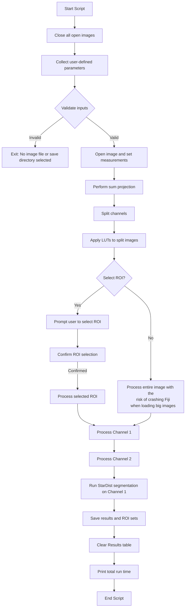

# Mouse Brain CFOS Analysis

This script is designed for analyzing mouse brain sections for CFOS, based on Stardist DAPI nuclei segmentation.
It was created by Daniel Waiger from the Bio-imaging & Flow Cytometry Core Facility at The Robert H. Smith Faculty of Agriculture, Food and Environment of the Hebrew University of Jerusalem.

## Author

Daniel Waiger
- **Email**: daniel.waiger@mail.huji.ac.il
- **Image.sc forum**: Daniel_Waiger

- **Institution**: CSI – Center for Scientific Imaging at The Robert H. Smith Faculty of Agriculture, Food and Environment of the Hebrew University of Jerusalem
- **DOI**: 

## Description

The script performs the following steps:
1. Opens the selected image file.
2. Performs a sum projection of the image.
3. Splits the image into channels.
4. Applies LUTs (Look-Up Tables) to the channels.
5. Prompts the user to select an ROI (Region of Interest) or processes the entire image.
6. Processes the selected channels.
7. Runs StarDist segmentation on the DAPI channel.
8. Saves the results and ROI sets.
9. Prints the total run time.

## Requirements

- ImageJ/Fiji
- Bio-Formats Plugin
- StarDist Plugin

## Installation

1. Install ImageJ/Fiji from the [official website](https://imagej.net/software/fiji/downloads).
2. Install the Bio-Formats plugin from the [official website](https://www.openmicroscopy.org/bio-formats/downloads/).
3. Install the StarDist plugin from the [official GitHub repository](https://github.com/stardist/stardist).

## Usage

1. Open ImageJ/Fiji.
2. Load the macro script into ImageJ/Fiji.
3. Run the script.
4. Follow the prompts to select the image file, save directory, channel names, and ROI selection.

# Mouse Brain CFOS Analysis Script Flowchart

